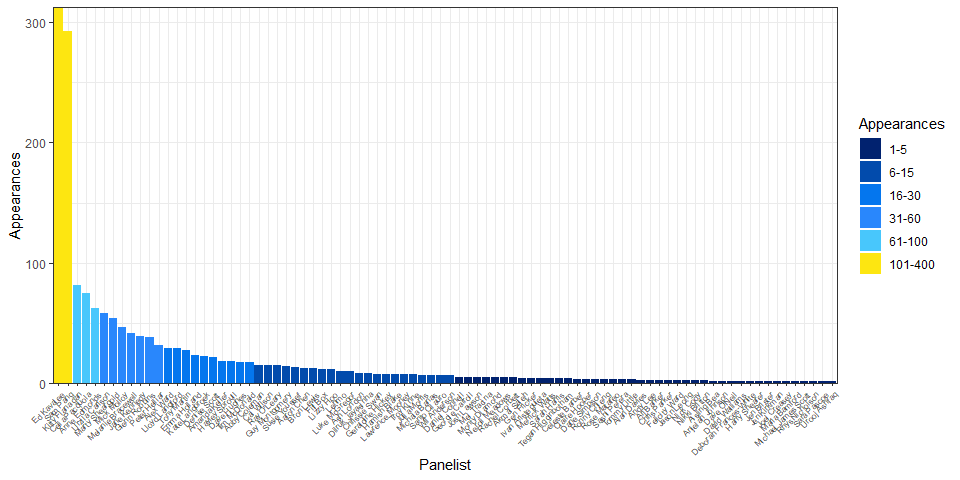
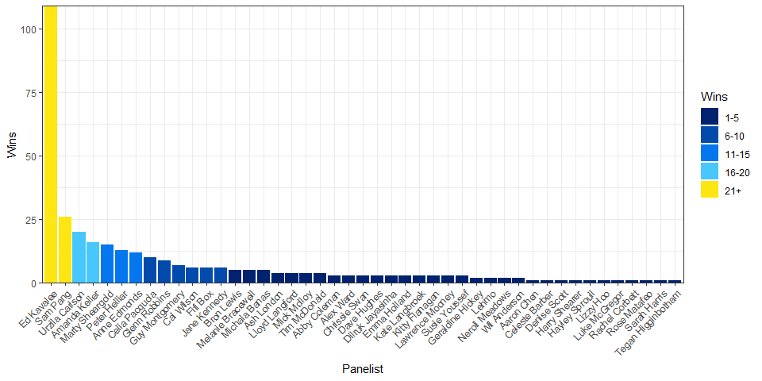
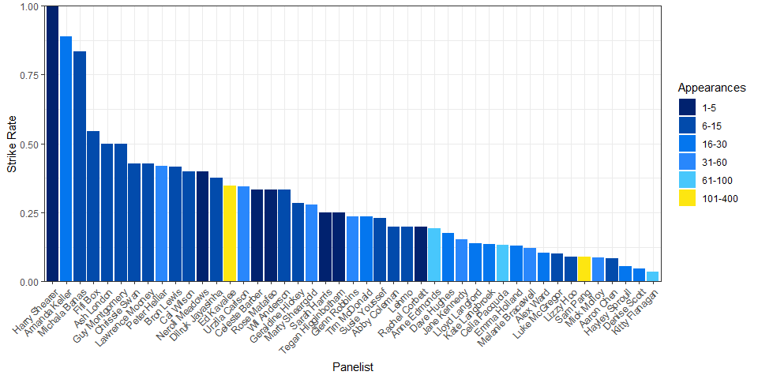
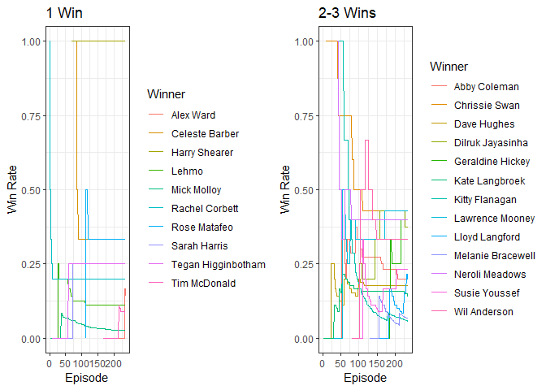
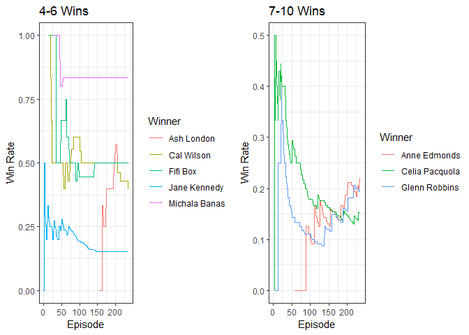
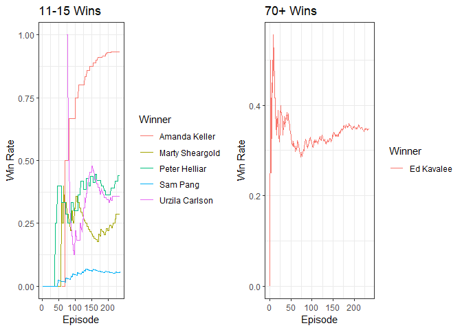
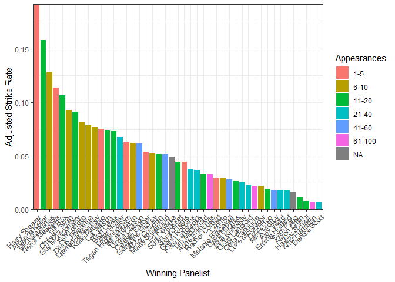
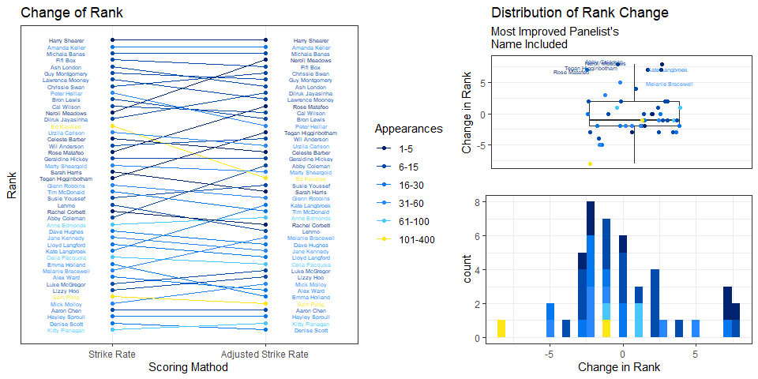
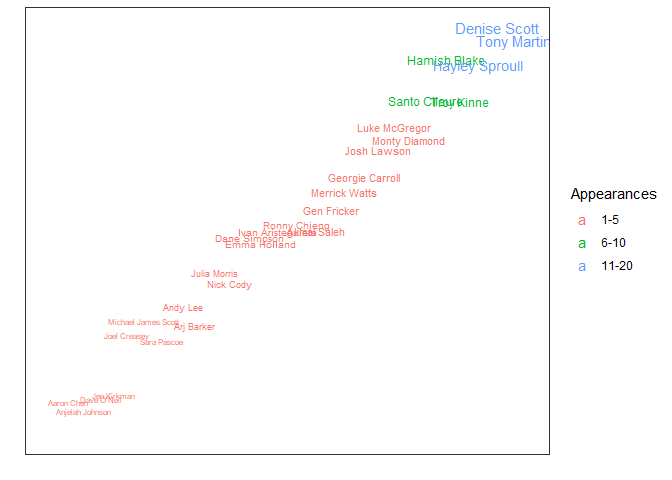

HYBPA? Analysis
================
Lachlan Webb
03/05/2022

## HYBPA

The show Have You Been Paying Attention? (HYBPA?) is a hilarious
Australian panel game television show. It mixes comedy with weekly news,
and is sometimes my only source of news for the week. Host Tom Gleisner
quizzes five guests each week, with Ed Kavalee and Sam Pang being two
permanent panelists of that five.

Being a fan for a long time, I am quite used to seeing Ed win the
competition each week, and Sam coming last. This is mainly due to Ed
focusing on answering the questions correctly, and Sam focusing on jokes
and making fun of host Tom.

I was curious if Ed really was the best performing panelist, so I pulled
the winner from each episode from the episode list on Wikipedia
<https://en.wikipedia.org/wiki/List_of_Have_You_Been_Paying_Attention%3F_episodes>

## Number of Wins and Number of Performances

So firstly, how often have the panelists appeared?

<!-- -->

Ed and Sam unsurprisingly have the most appearances, with Celia Pecquola
coming in a distant third.

The next obvious question is, of those who have won, who has the most
wins?

<!-- -->

So Ed has the most wins. Not surprising, given his permanent panelist
status and his eagerness to win.

But details such as this 1) aren’t that interesting, 2) are easily
calculated, and 3) can even be found on the Wikipedia page. Let’s dive a
little deeper.

## Strike Rate

So Ed has the most wins, but also the most appearances. Maybe we should
take both of these things into account. Let’s define a panelist’s
‘Strike Rate’ as their wins per appearance.

<!-- -->

Ed isn’t the front runner anymore. Now we have Harry Shearer up the
front with a perfect Strike Rate, closely followed by Amanda Keller at
93% and Michala Banas at 83%. At the other end, with Strike Rates close
to 0 we have Mick Malloy with a strike Rate of 2.5%, the hilarious Kitty
Flanagen at 5.7%, and our favourite panelist who hates every segment Sam
Peng with 5.8%. Ed has disappeared close to the middle with a Strike
Rate of 35%.

## How have panelists gone over time?

We should also look at how the panelists have progressed over time. A
panelists’ Strike Rate can only be 0 or 1 after one appearance, and with
more appearances we can get a more accurate of idea of how often they
win.

<!-- --><!-- --><!-- -->

We can see that Ed has been sitting pretty consistently around 30-35%
for a while. Amanda has been doing nothing but increase her Strike Rate
for ages after a couple of early losses.

## Adjusted Strike Rate

Now, comparing Strike Rate maybe isn’t a perfect comparison. I mean, the
ability for a panelist to win is not just how much they have been paying
attention that week, but also how much the other panelists have been
paying attention. So maybe when we try and figure out how often a
panelist wins, we should consider who they are beating.

Let’s define a panelists Adjusted Strike Rate as the sum of the Strike
Rates of the panelists they beat divided by their number of appearances.
That way, if a panelist beats opposing panelists who have high Strike
Rates, that win will contribute more to the Aggregated Strike Rate.

For example, Maelanie Bracewell has won twice and has a Strike Rate of
6.9% (due to her 29 appearances). In the Adjusted Strike Rate, instead
of 2/29, we add up the Strike Rate of the eight panelists (two lots of
four) and divide that by 29. The panelists Melanie beat were Ed Kavalee
(35%, twice), Ash London (50%), Marty Sheargold (29%), Sam Pang (5.8%,
twice), Tim McDonald (8.3%), and Kitty Flanagan (5.7%). So Melanie’s
Adjusted Strike Rate
\(= (0.35 \times 2 + 0.5 + 0.29 + 0.058 \times 2 + 0.083 + 0.057)/2 \approx 0.015\)

<!-- -->

Some things have changed, but some things haven’t. Harry Shearer still
has the best Adjusted Strike Rate, with Amanda Keller not far behind.
Michala Banas is now 4th, Neroli Meadows taking third. Mick Malloy is
still bringing up the rear with Kitty Flanagan keeping him company,
However Sam has jumped up a spot with Lehmo dropping a number of
positions.

Let’s look at all the changes in position (rank)

<!-- -->

So the most common change in rank is ‘no change’. The two biggest jumps
are Kate Langbrook (3 wins, 21 appearances) and Neroli Meadows (2 wins,
5 appearances).

Kate beat Ed Kavalee (SR = 35%, thrice), Lawrence Mooney (SR = 43%), Arj
Barker (no wins), Peter Helliar (SR = 44%), Michala Banas (SR = 83%),
Dave Hughes (SR = 18%), Sam Pang (SR = 6%, twice), Jane Kennedy (SR =
15%), and Josh Lawson (no wins). Her jump likely comes mainly from
beating Michala.

Neroli beat Ed Kavalee (SR = 35%, twice), Glenn Robbins (SR = 19%),
Akmal Saleh (no wins), Sam Pang (SR = 6%, twice), Amanda Keller (SR =
93%), and Marty Sheargold (SR = 29%). Beating Amanda Keller would
contribute a lot to Neroli’s jump.

Harry Shearer may be the highest rank in both scoring methods, but he
has only been a panelist once. Without playing multiple times, we don’t
know if he will be a consistently high scorer. Amanda Keller is a high
ranker after 15 appearances.

# A Finer Detail

Of course, a more effective comparison might be achieved if we looked at
the score the panelists achieve each episode. However, I couldn’t find
an easy way to get that information. In fact, what would be a great
resource is the individual score of each panelist per episode, broken
down general round questions, guest quizmaster questions, and mini
games. It be fun to see who is the best at “Going, Going, Gone”, “Trash
or Treasure”, and “Identify These International Versions of Well Known
Reality TV Formats”

# Those Who Never Win

We shouldn’t forget to mention all the panelists who have never won a
show.

<!-- -->

So Tony Martin, Denise Scott, and Hayley Sproull each have a number of
appearances but no wins as of yet. Hopefully in the future the pay a bit
more attention to the happenings of the week.

# A Conclusion

So what can we conclude from all of this; who is the best and who is the
worst? I think we can conclude that Mick Molloy is the most unlikely
winner with the lowest strike rate, Tony Martin is the poorest
performing panelist with no wins from 18 appearances, and Amanda Keller
appears to be the best performing panelist with a strike rate (and
adjusted strike rate) second only to one time panelist Harry Shearer. Of
course as we have seen, Strike Rates can change rapidly. Ideally we
would want that finer level of data to really tease out which panelist
has been paying the most attention. And in the end, I think we are the
winners because we get to watch the show.
