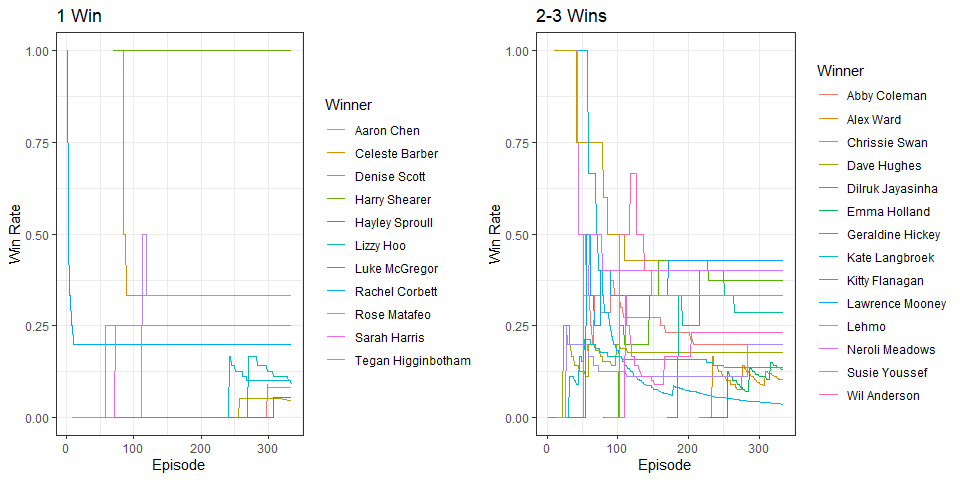
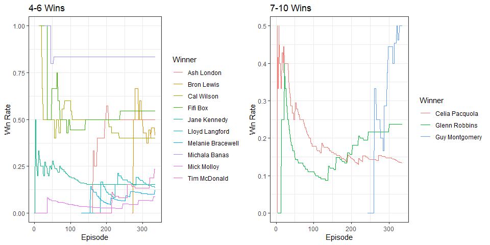
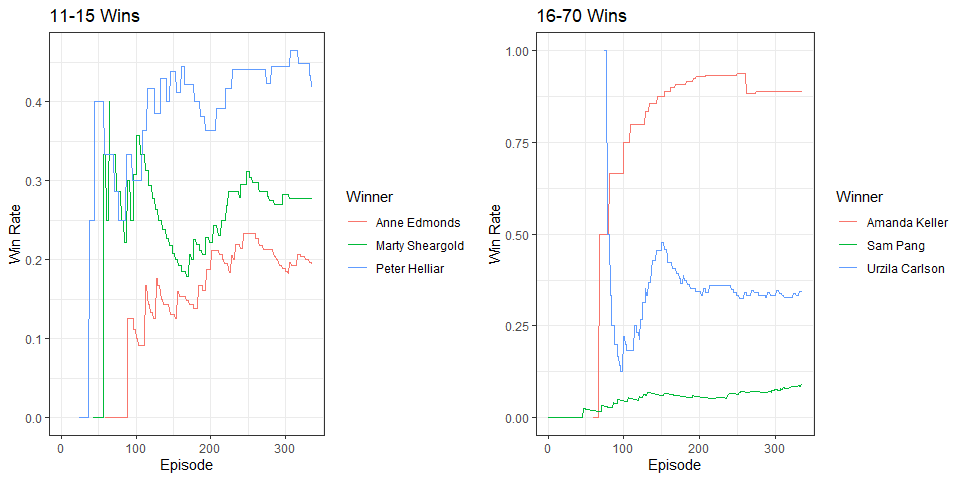
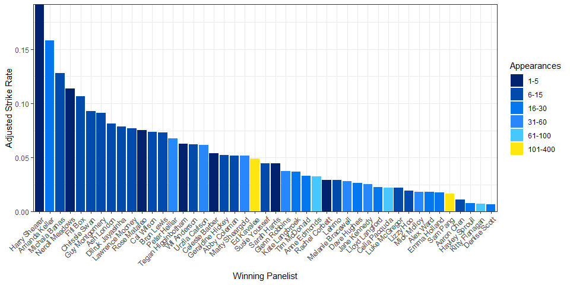
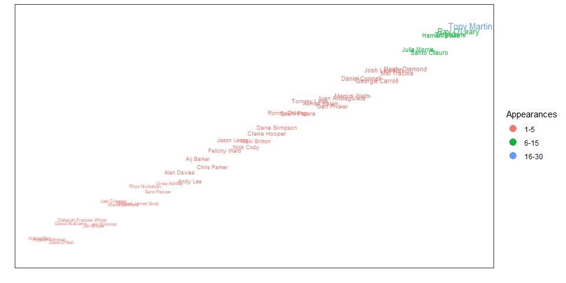
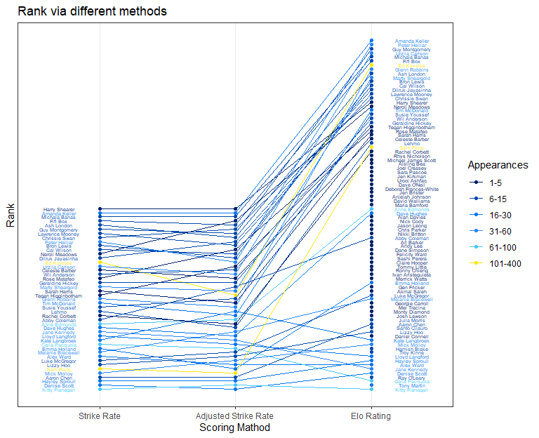

HYBPA? Analysis
================
Lachlan Webb
24/09/2025

## HYBPA

The show Have You Been Paying Attention? (HYBPA?) is a hilarious
Australian panel game television show. It mixes comedy with weekly news,
and is sometimes my only source of news for the week. Host Tom Gleisner
quizzes five guests each week, with Ed Kavalee and Sam Pang being two
permanent panelists of that five.

Being a fan for a long time, I am quite used to seeing Ed win the
competition each week, and Sam coming last. This is mainly due to Ed
focusing on answering the questions correctly, and Sam focusing on jokes
and making fun of host Tom.

I was curious if Ed really was the best performing panelist, so I pulled
the winner from each episode from the episode list on Wikipedia
<https://en.wikipedia.org/wiki/List_of_Have_You_Been_Paying_Attention%3F_episodes>

## Number of Wins and Number of Performances

So firstly, how often have the panelists appeared?

<!-- -->

Ed and Sam unsurprisingly have the most appearances, with Kitty Flanagan
coming in a distant third.

The next obvious question is, of those who have won, who has the most
wins?

<!-- -->

So Ed has the most wins. Not surprising, given his permanent panelist
status and his eagerness to win.

But details such as this 1) aren’t that interesting, 2) are easily
calculated, and 3) can even be found on the Wikipedia page. Let’s dive a
little deeper.

## Strike Rate

So Ed has the most wins, but also the most appearances. Maybe we should
take both of these things into account. Let’s define a panelist’s
‘Strike Rate’ as their wins per appearance.

<!-- -->

Ed isn’t the front runner anymore. Now we have Harry Shearer Harry
Shearer up the front with 100%, a perfect Strike Rate. Closely followed
by Amanda Keller at 88.9% and Michala Banas at 83.3%. At the other end,
with Strike Rates close to 0 we have Kitty Flanagan with a strike Rate
of 3.7%, the hilarious Denise Scott at 4.8%, and Hayley Sproull with
5.6%. Ed has disappeared close to the middle with a Strike Rate of
34.8%.

## How have panelists gone over time?

We should also look at how the panelists have progressed over time. A
panelists’ Strike Rate can only be 0 or 1 after one appearance, and with
more appearances we can get a more accurate of idea of how often they
win.

<!-- --><!-- --><!-- --><!-- -->

We can see that Ed has been sitting pretty consistently around 30-35%
for a while. Amanda has been mostly increasing her Strike Rate after a
couple of early losses.

## Adjusted Strike Rate

Now, comparing Strike Rate maybe isn’t a perfect comparison. I mean, the
ability for a panelist to win is not just how much they have been paying
attention that week, but also how much the other panelists have been
paying attention. So maybe when we try and figure out how often a
panelist wins, we should consider who they are beating.

Let’s define a panelists Adjusted Strike Rate as the sum of the Strike
Rates of the panelists they beat divided by their number of appearances.
That way, if a panelist beats opposing panelists who have high Strike
Rates, that win will contribute more to the Aggregated Strike Rate.

For example, *at May 2022* Maelanie Bracewell had won twice and had a
Strike Rate of 6.9% (due to her 29 appearances at the time). In the
Adjusted Strike Rate, instead of 2/29, we add up the Strike Rate of the
eight panelists (two lots of four) and divide that by 29. The panelists
Melanie beat were Ed Kavalee (35%, twice), Ash London (50%), Marty
Sheargold (29%), Sam Pang (5.8%, twice), Tim McDonald (8.3%), and Kitty
Flanagan (5.7%). So Melanie’s Adjusted Strike Rate in May 2022
$= (0.35 \times 2 + 0.5 + 0.29 + 0.058 \times 2 + 0.083 + 0.057)/2 \approx 0.015$

<!-- -->

Some things have changed, but some things haven’t. Harry Shearer still
has the best Adjusted Strike Rate, with Amanda Keller not far behind.
Michala Banas is now 3rd, Neroli Meadows taking fourth. Denise scott is
bringing up the rear with Kitty Flanagan keeping them company.

Let’s look at all the changes in position (rank)

<!-- -->

<!-- So the most common change in rank is 'no change'. The two biggest jumps are Kate Langbrook (3 wins, 21 appearances) and Neroli Meadows (2 wins, 5 appearances).  -->

<!-- Kate beat Ed Kavalee (SR = 35%, thrice), Lawrence Mooney (SR = 43%), Arj Barker (no wins), Peter Helliar (SR = 44%), Michala Banas (SR = 83%), Dave Hughes (SR = 18%), Sam Pang (SR = 6%, twice), Jane Kennedy (SR = 15%), and Josh Lawson (no wins). Her jump likely comes mainly from beating Michala.  -->

<!-- Neroli beat Ed Kavalee (SR = 35%, twice), Glenn Robbins (SR = 19%), Akmal Saleh (no wins), Sam Pang (SR = 6%, twice), Amanda Keller (SR = 93%), and Marty Sheargold (SR = 29%). Beating Amanda Keller would contribute a lot to Neroli's jump.  -->

<!-- Harry Shearer may be the highest rank in both scoring methods, but he has only been a panelist once. Without playing multiple times, we don't know if he will be a consistently high scorer. Amanda Keller is a high ranker after 15 appearances. -->

# Those Who Never Win

We shouldn’t forget to mention all the panelists who have never won a
show.

<!-- -->

So Tony Martin, Ray O’Leary, and Troy Kinne each have a number of
appearances but no wins as of yet. Hopefully in the future the pay a bit
more attention to the happenings of the week.

# Multiplayer Elo Rating

Perhaps we need a different approach entirely, that way we can give a
ranking to panelists who don’t win. Why would we want to give a
score/rank to someone who has never won? Who is a better performing
panelist between Aisling Bea, who has been on the show once and lost,
and Denise Scott, who has been on the show 21 times but only won once?
It isn’t a straightforward comparison, but we could argue that Aisling
shouldn’t be ranked lower than Denise, a they’ve had 20 losses to
Aisling’s one.

Using the methodology outlined in
<https://towardsdatascience.com/developing-a-generalized-elo-rating-system-for-multiplayer-games-b9b495e87802>,
we can calculate multiplayer Elo ratings. Elo ratings have traditionally
been used in 1 vs 1 games like chess and team vs team games like
football leagues. But we can extend it to multiplayer games. This is
useful as it means we can also rank players who never win. For our
calculations, every player starts with a rating of 1000, which changes
each time they appear (increase for win and decrease for loss).

<!-- --><!-- --><!-- --><!-- --><!-- -->

And how do the different ranking methods at the end of 2021 season
compare?

<!-- -->

Our ‘cost’ function for the Elo rating system was 1 for a win, and 0 for
a loss, regardless of place. If we had the individual scores, we could
perhaps provide a fairer cost function to those who narrowly lose as
opposed to those who lose by a lot.

We can see from the different ranking methods, that panelists who appear
a lot but don’t win a lot (i.e. Kitty Flanagan and Celia Pacquola) have
a lower Elo rating than panelists who have never won but who have only
appeared a few times (i.e. Joel Creasey and Sarah Pascoe).

Amanda Keller has the top ranking with Elo ratings, with Harry Shear
dropping down the ranks.

# A Finer Detail

Of course, a more effective comparison might be achieved if we looked at
the score the panelists achieve each episode. However, I couldn’t find
an easy way to get that information. In fact, what would be a great
resource is the individual score of each panelist per episode, broken
down general round questions, guest quizmaster questions, and mini
games. It be fun to see who is the best at “Going, Going, Gone”, “Trash
or Treasure”, and “Identify These International Versions of Well Known
Reality TV Formats”. Plus, seeing if there are benefits to going first
or last in a minigame (when panelists make their decision more on how
many Trash or Treasures have already been then deciding based on the
footage) would be fascinating.

# A Conclusion

So what can we conclude from all of this; who is the best and who is the
worst? I think we can conclude that Kitty Flanagan is the most unlikely
winner with the lowest strike rate and Elo Rating, Tony Martin is the
poorest performing panelist with no wins from 27 appearances, and Amanda
Keller appears to be the best performing panelist with a strike rate
(and adjusted strike rate) second only to one time panelist Harry
Shearer. Of course as we have seen, Strike Rates and Elo Ratings can
change rapidly. Ideally we would want that finer level of data to really
tease out which panelist has been paying the most attention. And in the
end, I think we are the winners because we get to watch the show.

*Results up to date as of 24/09/2025*
